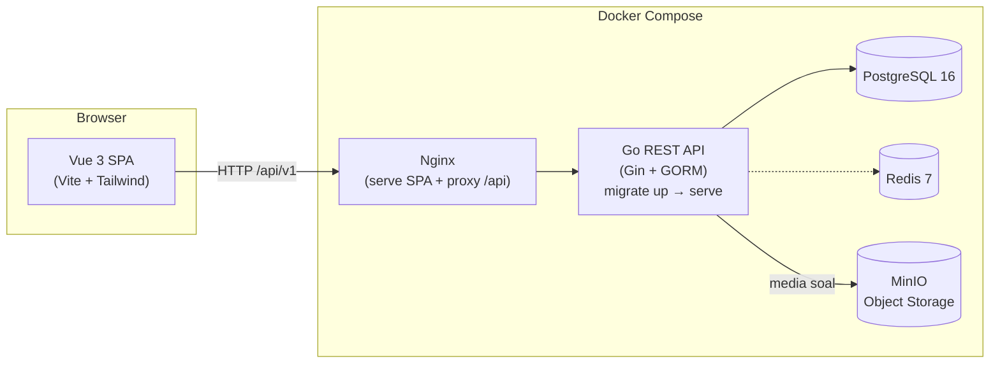
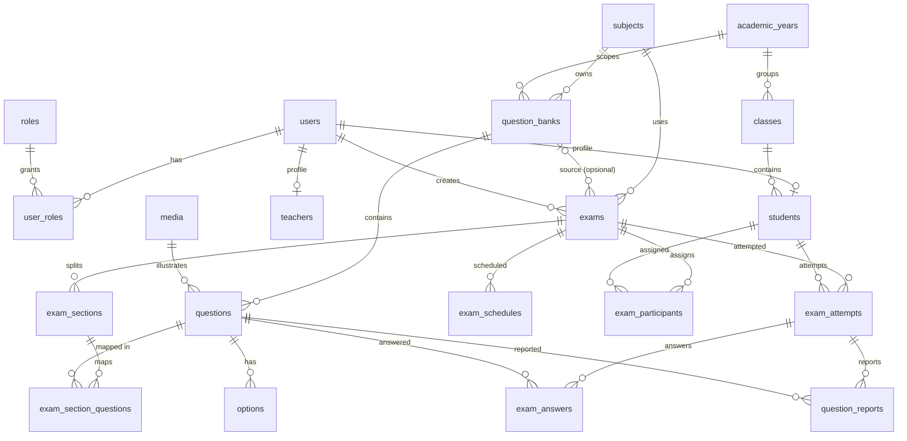

# MCBT — Computer-Based Test (Ujian Berbasis Komputer)

Aplikasi ujian berbasis komputer untuk sekolah: manajemen bank soal, ujian dengan section,
pelaksanaan ujian anti-cheat, penilaian otomatis & esai, rekap ranking, laporan soal,
dashboard analitik, serta ekspor data ke Excel/PDF.

---

## Fitur Utama

| Modul | Kemampuan |
|---|---|
| Autentikasi | Login siswa/guru/admin, JWT HttpOnly cookie + refresh rotasi, CSRF protection, ganti password, profil |
| Master Data | Tahun ajaran, kelas, mata pelajaran, guru, siswa (CRUD + impor Excel) |
| Bank Soal | CRUD bank & soal (PG, B/S, multi-jawab, esai, isian), editor rich-text + media, impor Excel, clone |
| Ujian | CRUD, pengaturan (durasi, attempt, randomisasi, KKM, token, pembahasan), publish/close |
| Section | Bagi ujian menjadi section, mapping soal dari banyak bank, jumlah soal acak |
| Pelaksanaan | Token masuk, timer server-side, autosave + heartbeat, flag ragu-ragu, laporkan soal |
| Penilaian | Skor otomatis PG/B-S/Multi/Isian, penilaian manual esai, publikasi hasil |
| Hasil | Rekap nilai + ranking per ujian/kelas, hasil pribadi siswa, ekspor Excel/PDF |
| Pembahasan | Pembahasan soal setelah submit (dikendalikan flag per ujian) |
| Laporan Soal | Siswa melapor soal; guru/admin menangani dengan resolusi |
| Dashboard | Statistik admin/guru/siswa |
| Ekspor | Daftar siswa/guru, rekap & ranking ujian → Excel (.xlsx) & PDF |

## Teknologi

- **Backend:** Go (Gin, GORM, PostgreSQL), JWT, excelize, go-pdf/fpdf
- **Frontend:** Vue 3 + TypeScript + Vite, Tailwind CSS, Lucide icons
- **Infrastruktur:** Docker Compose — PostgreSQL 16, Redis 7, MinIO (S3-compatible), Nginx

---

## Arsitektur



Alur request: SPA → Nginx (`/api/*` di-proxy ke `api:8080`) → middleware chain
(RequestID → Logger → Recovery → ErrorHandler → CSRF) → route group berbasis role
(`admin` / `admin+teacher` / `student`) → handler → usecase → repository → PostgreSQL.

### Model Akses & Data Scope

| Role | Hak akses |
|---|---|
| Admin | Penuh atas seluruh modul |
| Guru | CRUD bank soal & ujian miliknya, menangani laporan pada ujiannya, lihat semua bank soal (read-only untuk milik orang lain), menu siswa read-only |
| Siswa | Ujian yang ditugaskan, hasil & pembahasan sendiri, lapor soal |

Kepemilikan: bank soal → `created_by`; ujian → `created_by`;
laporan/section/jadwal/nilai diverifikasi berantai hingga ujian.

---

## ERD (ringkas)



---

## Instalasi

### Prasyarat
Go 1.27+, Node.js 20+, Docker (opsional), PostgreSQL 16 berjalan lokal (untuk mode dev).

### 1) Development lokal (tanpa Docker)

```bash
# 1. salin env & sesuaikan
cp .env.example .env

# 2. jalankan migrasi
go run ./cmd/migrate up

# 3. backend (port 9090)
go run ./cmd/api

# 4. frontend (port 5173, proxy /api → 9090)
cd frontend && npm install && npm run dev
```

Seed awal membuat akun admin default:

| Akun | Username | Password |
|---|---|---|
| Admin | `admin123` | `Admin@123` |

Siswa/guru baru dibuat admin dengan password default `McBT@1234`
(dapat direset lewat menu masing-masing).

### 2) Produksi via Docker Compose

```bash
cp .env.example .env      # wajib isi JWT_SECRET acak & aman
docker compose up -d --build
```

Layanan yang aktif:

| Layanan | Port host | Keterangan |
|---|---|---|
| `web`   | `${WEB_PORT:-5173}` | Nginx: SPA + reverse proxy `/api` |
| `api`   | `${API_PORT:-8080}` | Migrasi otomatis lalu serve REST API |
| `postgres` | `${DB_PORT:-5432}` | Database utama |
| `redis` | `${REDIS_PORT:-6379}` | Disiapkan untuk cache/queue |
| `minio` | `${S3_API_PORT:-9000}` / console `9001` | Media soal (bucket auto-created) |

### Variabel Lingkungan (ringkas)

| Var | Default | Keterangan |
|---|---|---|
| `APP_HOST` / `APP_PORT` | `localhost` / `8080` | Bind address API |
| `DB_HOST` … `DB_NAME` | — | Koneksi PostgreSQL (**wajib**) |
| `JWT_SECRET` | — | Kunci HMAC (**wajib** di compose) |
| `JWT_ACCESS_TTL_MINUTES` | `15` | Umur access token |
| `JWT_REFRESH_TTL_DAYS` | `7` | Umur refresh token |
| `COOKIE_SECURE` / `COOKIE_SAMESITE` | `false` / `strict` | Atribut cookie |
| `S3_ENDPOINT`, `S3_*_KEY`, `S3_BUCKET`, `S3_PUBLIC_URL` | MinIO lokal | Object storage media |

---

## Dokumentasi API

Spesifikasi lengkap tersedia dalam format **Swagger/OpenAPI**: [`docs/openapi.yaml`](docs/openapi.yaml).

**Playbook membangun dari nol**: [`docs/REBUILD_PLAYBOOK.md`](docs/REBUILD_PLAYBOOK.md) —
langkah demi langkah (database, backend B1–B15, frontend F1–F12, infrastruktur, verifikasi)
lengkap dengan endpoint & contoh respons. Versi PDF: `docs/rebuild-playbook.pdf`
(regenerasi: `go run ./cmd/gendocs`).

Ringkasan endpoint utama (`prefix /api/v1`):

| Grup | Endpoint contoh |
|---|---|
| Auth | `POST /auth/login`, `POST /auth/refresh-token`, `GET /auth/me`, `GET|PUT /auth/profile`, `PUT /auth/change-password` |
| Master | `/academic-years`, `/classes`, `/subjects`, `/teachers`, `/students` (CRUD, impor Excel, reset password) |
| Bank Soal | `/question-banks` (CRUD, clone, publish, archive), `/question-banks/:id/questions`, `/questions/import/*` |
| Ujian | `/exams` (CRUD), `PUT /exams/:id/settings`, `PATCH /exams/:id/publish|close`, `GET /exams/:id/questions` (review) |
| Section | `/exams/:id/sections`, `POST /sections/:id/questions` (mapping), `DELETE /sections/:id/questions/:qid` |
| Peserta | `/exams/:id/participants/assign-class|assign-individual`, `/exams/:id/schedules`, `POST /schedules/:id/generate-token` |
| Ujian Siswa | `POST /candidate/exams/:id/start`, `/attempts/:id/answers`, `/heartbeat`, `/autosave`, `/submit`, `GET /attempts/:id/discussion`, `POST .../report` |
| Nilai | `GET /exams/:id/results`, `PATCH /exams/:id/publish-results`, `GET /students/:id/results`, `PUT /attempts/:id/grade-essay` |
| Laporan | `GET /question-reports`, `PATCH /question-reports/:id/resolve` |
| Dashboard | `GET /dashboard/admin|teacher|student` |
| Ekspor | `GET /exams/:id/export?format=xlsx|pdf`, `GET /export/students|teachers` |
| Media | `POST /media/upload`, `GET /media/:id/file` |

Autentikasi memakai cookie `access_token` (HttpOnly) + header `X-CSRF-Token`
untuk metode tidak aman (POST/PUT/PATCH/DELETE).

---

## Testing

```bash
# unit test backend (93 test usecase + pkg)
go test ./...

# coverage paket usecase
go test -cover ./internal/usecase/

# component test frontend
cd frontend && npm test

# build verifikasi
go build ./... && cd frontend && npm run build
```

### Strategi Test Backend

Usecase dites dengan **consumer-defined interface** (`internal/usecase/interfaces.go`)
+ **fake hand-written** (`fakes_test.go`) — tanpa DB nyata, tanpa dependensi mock.
Kontrak penting yang dijaga fake: repo user mengembalikan `(nil, nil)` saat data
tidak ditemukan; repo lain memancarkan `gorm.ErrRecordNotFound`.

Cakupan: seluruh usecase in-scope (auth, master data, bank soal, ujian, section,
attempt engine + skoring, grading, hasil, laporan, jadwal/peserta, dashboard,
profil, ekspor, impor Excel). `media` (S3/MinIO) di luar cakupan unit test.
Jam server diinjeksi (`now func() time.Time`) sehingga kasus kedaluwarsa & jendela
ujian dites deterministik.

## Struktur Proyek

```
├── cmd/
│   ├── api/            # entrypoint server
│   └── migrate/        # CLI migrasi (up/down/status)
├── internal/
│   ├── config/         # konfigurasi env
│   ├── database/       # koneksi DB
│   ├── model/          # entitas GORM
│   ├── repository/     # akses data
│   ├── usecase/        # logika bisnis
│   ├── delivery/http/handler/  # HTTP handlers
│   ├── server/         # router + middleware (auth, csrf, scope)
│   └── pkg/            # jwt, password, response, apperror, storage, logger
├── migrations/         # SQL migrasi versi (golang-migrate)
├── frontend/           # Vue 3 SPA
│   └── src/{pages,components,services,stores,composables,router}
├── docs/openapi.yaml   # spesifikasi Swagger
└── docker-compose.yml
```
